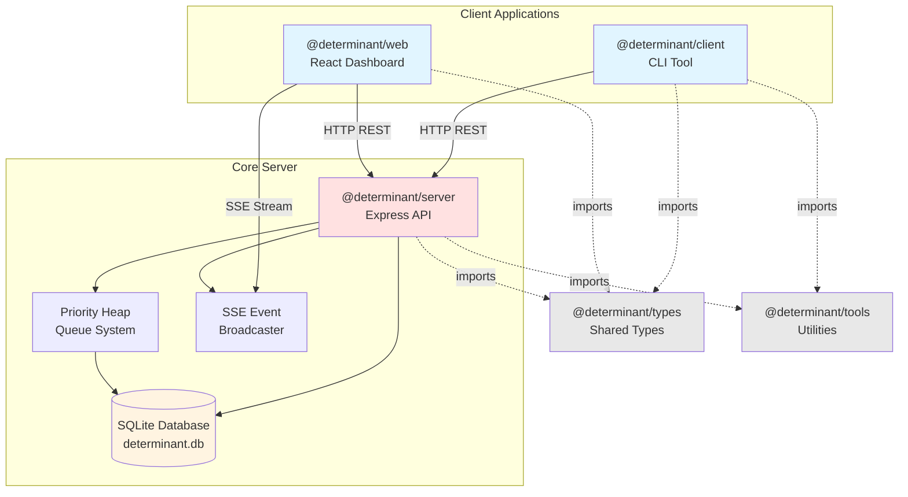
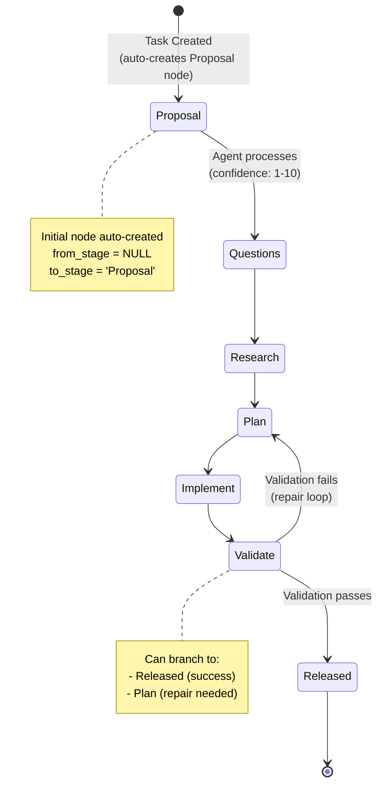
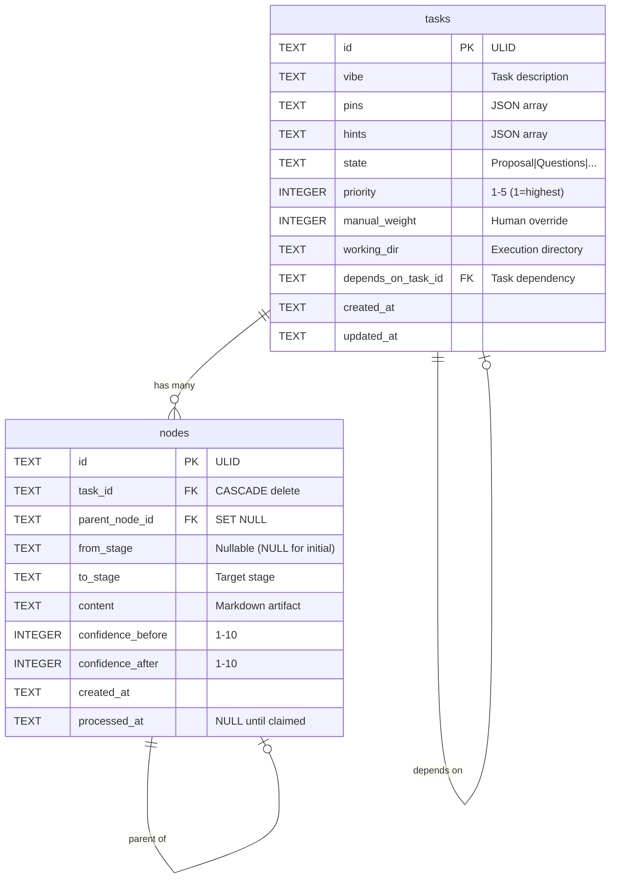
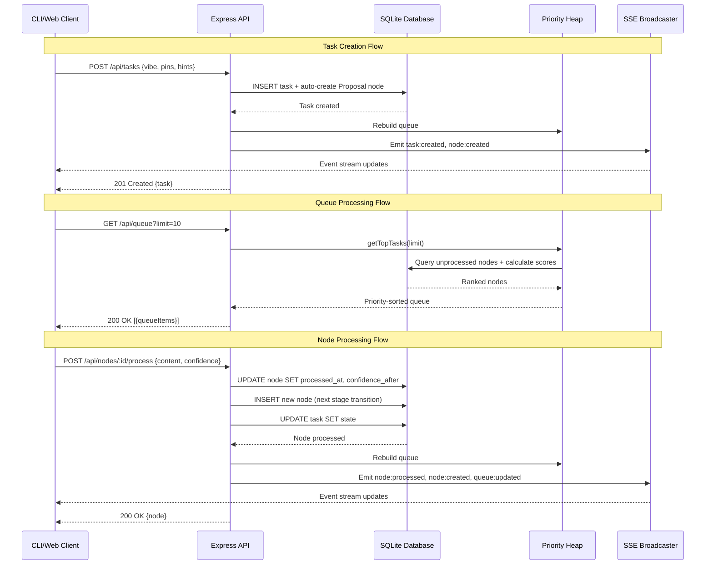

# Determinant Architecture

> **Visual documentation of the Determinant system**
> 
> This document provides mermaid diagrams illustrating the architecture, workflow, data models, and interaction patterns of the Determinant task management system.

## About These Diagrams

These diagrams are generated using [Mermaid](https://mermaid.js.org/), which renders in GitHub, most markdown viewers, and many IDEs. If your viewer doesn't support mermaid, you can:
- View on GitHub (native support)
- Use the [Mermaid Live Editor](https://mermaid.live/) to paste and render
- Install a mermaid preview plugin for your editor

## System Overview

Determinant is an agentic workflow pipeline with task prioritization and confidence scoring. Tasks progress through a linear workflow with stage-specific artifacts, while a configurable priority queue determines processing order.

**Key Characteristics:**
- Linear workflow with repair loops
- Confidence-based prioritization
- Parent-child node progression tracking
- Real-time updates via Server-Sent Events
- Dependency-aware task scheduling

## Quick Reference
- [System Architecture](#system-architecture) - Component relationships
- [Workflow State Machine](#workflow-state-machine) - Task progression
- [Database Schema](#database-schema) - Data models and relationships
- [Data Flow](#data-flow) - API interaction sequences

---

## System Architecture

### System Components

**Client Layer:**
- **CLI** - Command-line interface for task management and processing
- **Web Dashboard** - Real-time React application for visualization

**Server Layer:**
- **Express API** - REST endpoints for CRUD operations
- **Priority Heap** - Configurable task prioritization queue
- **SSE Broadcaster** - Real-time event streaming to clients
- **SQLite Database** - Persistent storage with WAL mode

**Shared Packages:**
- **Types** - TypeScript definitions shared across packages
- **Tools** - Common utilities

**Communication:**
- REST API: Client ↔ Server operations
- SSE: Server → Clients for real-time updates

---

## Workflow State Machine

### Workflow Stages

Tasks progress linearly through 7 stages, with each stage producing a markdown artifact:

1. **Proposal** - Initial task definition (auto-created)
2. **Questions** - Identify knowledge gaps
3. **Research** - Answer questions and gather context
4. **Plan** - Create implementation plan
5. **Implement** - Execute the plan
6. **Validate** - Verify implementation
7. **Released** - Task complete

**Repair Loop:**
When validation fails, the agent can create a new node transitioning from Validate → Plan, creating a repair cycle that repeats until validation passes.

**Confidence Scoring:**
At each transition, agents assign confidence scores (1-10):
- `confidence_before`: Initial confidence before starting work
- `confidence_after`: Final confidence after completing work

---

## Database Schema

### Database Tables

**tasks**
- Primary entity representing a task in the system
- `state` matches the current stage the task is in
- `priority` (1-5) affects queue ranking (1 = highest priority)
- `depends_on_task_id` creates dependency chains (circular dependencies blocked)

**nodes**
- Represents a stage transition with its artifact
- Each node has a parent-child relationship for tracking progression
- Initial Proposal node has `from_stage = NULL`
- `processed_at` is NULL until an agent claims and processes the node
- Repair loops create new nodes: `parent_node_id` points to failed Validate node

**Key Relationships:**
- One task → Many nodes (entire progression history)
- One node → One parent node (forms tree structure)
- One task → One dependency task (optional)

**Indexes:**
- idx_nodes_task_id, idx_nodes_parent, idx_nodes_processed_at
- idx_tasks_state, idx_tasks_depends_on

---

## Data Flow

### Typical Interaction Flows

**Task Creation:**
1. Client sends task details (vibe, pins, hints) to API
2. Server creates task + auto-generates initial Proposal node
3. Priority heap rebuilds queue
4. SSE broadcasts events to all connected clients
5. Node enters queue for processing

**Queue Retrieval:**
1. Client requests priority queue
2. Heap queries unprocessed nodes from database
3. Applies scoring formula: `priorityWeight × (6-priority) + confidenceWeight × confidence + manualWeight × manual`
4. Returns top N ranked nodes

**Node Processing:**
1. Client claims a node and processes it
2. Updates node with artifact content and confidence scores
3. Creates new node for next stage transition
4. Updates task state to match new node's to_stage
5. Heap rebuilds queue, SSE broadcasts updates
6. New node enters queue for next agent

**Real-time Updates:**
- SSE connection streams events: `task:created`, `task:updated`, `node:created`, `node:processed`, `queue:updated`
- Web dashboard receives updates without polling
- Max 1000 concurrent SSE connections
